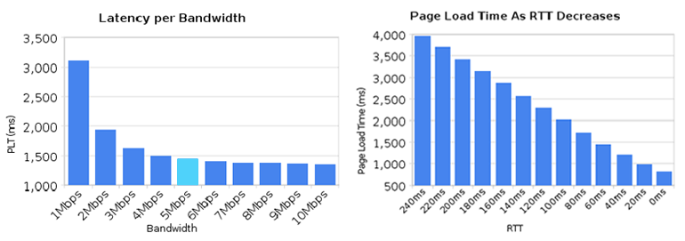
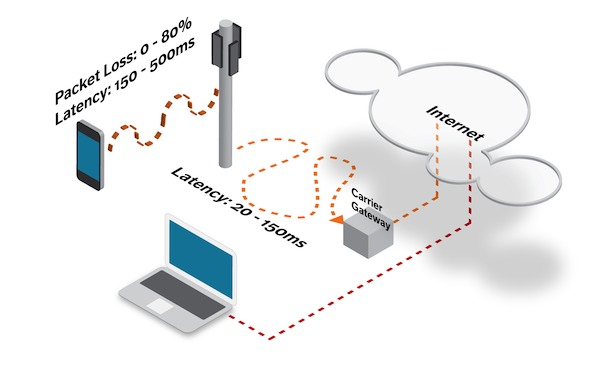
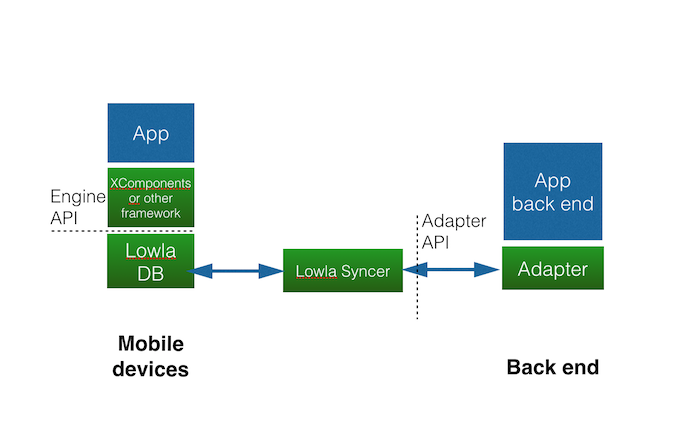

  
## Introduction ##
LowlaDB is a database designed from the ground up to support connected mobile applications. It can be used to create the following kinds of apps:

* Super-fast microsites for mobile devices
* Offline-capable apps for consumers
* Offline-capable apps for the enterprise

A microsite is a typically a small cluster of web pages that function as a discrete entity and have their own domain name or sub-domain. They are often used for promotional purposes to support commercial marketing campaigns.  By caching the microsite content within LowlaDB, user access to the content can be accelerated.

Offline-capable apps include enterprise productivity apps, such as contact management or field service tracking.  For these apps it is very useful to be able to access information when the mobile device is offline.  

The usability of almost any kind of consumer app can be enhanced by adding offline capability.  This allows the app is still be responsive when the wireless network is busy or unavailable.

Our technical objectives for LowlaDB are fourfold:
 
1. Low-latency data access
2. Offline capability
3. Multi-platform capability
4. Flexibility to sync to different back ends
 
In supporting these objectives, we’ve put a lot of effort into making the developer API easy and intuitive to use.
 

  
## Low latency ##
Mobile networks are much faster than they used to be. However, once sufficient bandwidth is available then latency becomes far more important than bandwidth in determining the responsiveness of an app.  
 
There is a minimal improvement in page load time as mobile bandwidth increases beyond 5 Mbps, but a continuing linear improvement as latency decreases (graph from Ilya Grigorik, Google <https://www.igvita.com/2012/07/19/latency-the-new-web-performance-bottleneck/> ).
 

 
*Graphic credit: Ilya Grigorik (Google)*
 
Wireless internet connections have surprisingly high latency (graphic courtesy of Mobify, <http://www.mobify.com/blog/web-performance-optimization/>). By locating the datastore on the device, our measurements show that developers can achieve a minimum 4-fold reduction in latency time for data access compared to a wireless connection. In typical real world conditions that advantage rises to 10X or more.  
 
 
 
 

 

 
## Offline capability ##
With real-world wireless networks  it is not possible to guarantee that any device will be online 100% of the time.  There are many network dead spots where coverage is poor or non-existent.  Networks can become overloaded at peak times resulting in loss of access. Interference from other radio sources may cause severe packet loss. Well-designed mobile apps should not block the user when their device is offline, but continue to function and then sync their data with the back end system when the network returns.  LowlaDB’s goal is to make it much easier to develop this kind of application.  
 

  
## Multiplatform ##
We now carry many different types of devices – laptops, phones and tablets – each of which may be best for any given task.  We want our apps to run on all of our devices and sync data automatically between them.  In the future, the Internet of Things will add to this device variety.  For all these reasons it’s important that LowlaDB is architected to make it easy to port to the widest possible range of platforms.
 
The initial release of LowlaDB is a pure Javascript implementation that runs on either IndexedDB or in memory.  For IndexedDB implementations it is suitable for databases up to 20MB in size and up to 10k items, providing a rapid development cycle.
 
If your application needs to scale to larger databases, a later release of LowlaDB will add a specialized datastore implementaton designed to run in Cordova. Web applications built with LowlaDB will run in Cordova with no code changes required and will automatically detect and use the improved datastore. The Cordova implementation will also add features not possible in the browser such as overnight syncing.
 

  
## Backend flexibility ##
Mobile apps are a combination of a front end running on the device and a back end running in the cloud or in an enterprise data center.  These back ends are very diverse. They can be built on either SQL and NoSQL databases.  They may provide a RESTful API to the front end, or some other kind of API across the network.  To accommodate all of these different scenarios, LowlaDB provides a great deal of flexibility in connecting to different back ends.  This is achieved by the provision of a modular adapter layer between the Lowla Syncer and the back end system.
 

 
With the appropriate adapters, LowlaDB syncs data from a wide variety of back ends down to the device so that apps can always use data that is stored locally. That makes applications fast because data is always close by and reliable because they never have to worry about wireless signal strength or the availability of WiFi.  In the initial implementation adapters are written in Javascript and run on Node.js, although the architecture makes provision for creating adapters in other languages.
 

  
## Developer API ##
Database APIs should be easy and intuitive to use. The developer API for LowlaDB is based closely on MongoDB. An overview of the API follows, but for more details on the direction in which we intend to take the API, see the documentation for the Node.js MongoDB driver [here](http://mongodb.github.io/node-mongodb-native/index.html). In addition to the basic API, LowlaDB adds extensions to support real-time data updates and wherever possible offers promise-based APIs as an alternative to callbacks.
 

